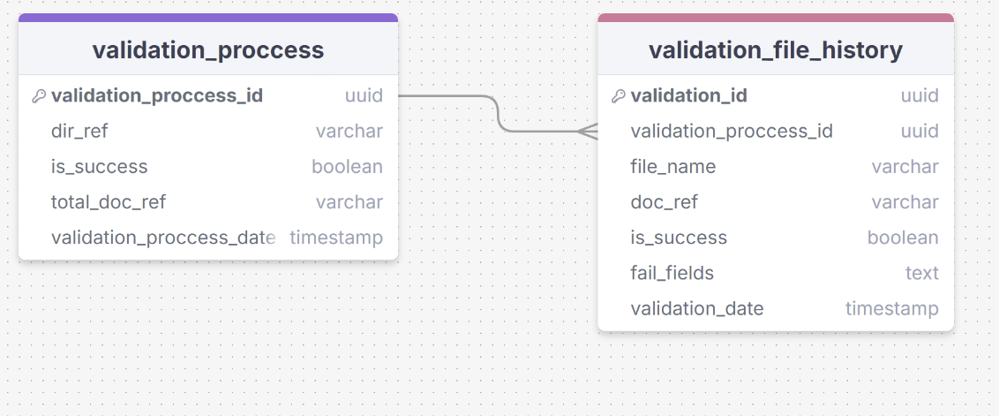

# Просмотр истории валидации
В данной фиче берется в работу эндпоинт по просмотру истории провалидированных платежных документов. Пользователь может просматривать историю провалидированных файлов с учетом сортировок и фильтрации для быстрого поиска в данных, что хранятся в базе данных.
## Пользовательский ввод
Пользователь переходит на вкладку "Просмотр истории валидации", где есть панель сортировки, поиска и фильтров которые пользователь может в дальнейщем настроить.
## Вывод пользователю
При первичном просмотре выводится все содержимое таблицы validation_file_history отсортированное по полю validation_date. Далее, пользователь способен использовать поиск, фильтрацию и сортировку. Следует учесть, что в таблице validation_file_history в поле doc_ref внесена абсолютная ссылка на валидируемый файл при нажатии на которую на клиенте приложения пользователь способен перейти к просмотру этого файла (например, открывается провыодник windows, где будет выделен этот платежный документ).
## Структура БД

### Описание сущностей базы данных:
| Сущность                | Описание                                                                                           |
|-------------------------|----------------------------------------------------------------------------------------------------|
| validation_process      | Содержит информацию о каталоге с файлами платежей                                                  |
| validation_file_history | Содержит информацию о валидируемых файлах, а также о результатах валидации и об ошибках валидации. |

**validation_process**

| Атрибут                 | Тип данных | Описание                                                       | Ограничение     | Пример                              |
|-------------------------|------------|----------------------------------------------------------------|-----------------|-------------------------------------|
| validation_process_id   | uuid       | Уникальный идентификатор                                       | primary_key     | 71f5135e-fb46-415c-b4cf-bbb9be5692d |
| dir_ref                 | varchar    | Cсылка в windows проводнике на каталог с валидируемыми файлами | nullable: false | c:/Users/Ivanov/test/               |
| is_success              | boolean    | Прошел валидацию каталог или нет                               | nullable: false | true false                          |
| total_doc_ref           | varchar    | Ссылка на итоговый документ                                    | nullable: false | с:/Users/Ivanov/test/total          |
| validation_process_date | timestamp  | Дата завершения процесса валидации                             | nullable: false | 2023-11-14 15:02:38.550722          |

**validation_file_history**

| Атрибут               | Тип данных | Описание                                          | Ограничение     | Пример                              |
|-----------------------|------------|---------------------------------------------------|-----------------|-------------------------------------|
| validation_id         | uuid       | Уникальный идентификатор                          | primary_key     | 71f5135e-fb46-415c-b4cf-bbb9be5692d |
| validation_process_id | uuid       | Уникальный идентификатор                          | foreign_key     | 71f5135e-fb46-415c-b4cf-bbb9be5692d |
| file_name             | varchar    | Имя файла                                         | nullable: false |                                     |
| doc_ref               | varchar    | Ссылка в windows проводнике на  валидируемый файл | nullable: false | с:/Users/Ivanov/test/pay            |
| is_success            | boolean    | Прошел валидацию файл или нет                     | nullable: false | true false                          |
| fail_fields           | text       | Поля файла, которые не прошли валидацию           | nullable: true  |                                     |
| validation_date       | timestamp  | Дата завершения валидации файла                   | nullable: false | 2023-11-14 15:02:38.550722          |
## Алгоритм работы запроса "просмотра истории валидации"
1. Когда пользователь переходит по вкладке "просмотра истории валидации", происходит SELECT запрос от бэкенда в таблицу БД validation_file_history. 
2. При успешном ответе, бэкенд формирует сериализованный json и отправляет на фронт.
3. Фронт выводит информацию полученую из json файла отсортированное по полю validation_date.
4. Если файлов не онаружено в бд, бэкенд отправляет пустой список, фронт отображает пустое поле.
## Работа сортировки "просмотра истории валидации"
- После вывода полученных файлов на фронте, пользователь может искать, фильтровать, сотривоать отображенные файлы, полученые от бекенда  
- При нажатии на ссылку на валидируемый файл открывается проводник, в котором находится выделеный файл.  
## Пример json файла
```[
    {
        "validationId": "4d3e3471-fb85-4551-8c6f-2f9e7ca01099",
        "fileName": "Vasechkin3.txt",
        "docRef": "c:/Users/Vasechkin/test/Vasechkin3.txt",
        "isSuccess": true,
        "failFields": null,
        "validationDate": "2024-08-25T09:22:15.834949",
        "validationProcessId": "f0c57cb2-8ca2-4460-9a21-d9e36f389ad4"
    },
    {
        "validationId": "f3db86a1-ccbe-454e-99c6-f90beb6e1cfd",
        "fileName": "Vasechkin1.txt",
        "docRef": "c:/Users/Vasechkin/test/Vasechkin1.txt",
        "isSuccess": true,
        "failFields": null,
        "validationDate": "2024-08-25T09:22:15.834949",
        "validationProcessId": "f0c57cb2-8ca2-4460-9a21-d9e36f389ad4"
    },
    {
        "validationId": "2d8f8dc2-54b4-4837-9ca8-d79ff26afa27",
        "fileName": "Vasechkin2.txt",
        "docRef": "c:/Users/Vasechkin/test/Vasechkin2.txt",
        "isSuccess": true,
        "failFields": null,
        "validationDate": "2024-08-25T09:22:15.834949",
        "validationProcessId": "f0c57cb2-8ca2-4460-9a21-d9e36f389ad4"
    },
    {
        "validationId": "657726a2-e54b-424e-863b-db6433eb31c8",
        "fileName": "Sidorov2.txt",
        "docRef": "c:/Users/Sidorov/test/Sidorov2.txt",
        "isSuccess": true,
        "failFields": null,
        "validationDate": "2024-08-24T09:22:15.834949",
        "validationProcessId": "565c0b13-1b82-43db-a701-8d9da64a6130"
    },
    {
        "validationId": "e28556b6-88d8-4d16-ae30-0ca880142a6d",
        "fileName": "Sidorov1.txt",
        "docRef": "c:/Users/Sidorov/test/Sidorov1.txt",
        "isSuccess": true,
        "failFields": null,
        "validationDate": "2024-08-24T09:22:15.834949",
        "validationProcessId": "565c0b13-1b82-43db-a701-8d9da64a6130"
    },
    {
        "validationId": "2622e29f-9294-46ca-96c1-ad2d018827a2",
        "fileName": "Sidorov3.txt",
        "docRef": "c:/Users/Sidorov/test/Sidorov3.txt",
        "isSuccess": true,
        "failFields": null,
        "validationDate": "2024-08-24T09:22:15.834949",
        "validationProcessId": "565c0b13-1b82-43db-a701-8d9da64a6130"
    },
    {
        "validationId": "b8988f54-961c-46cb-a8ea-296637fcc770",
        "fileName": "Ivanov1.txt",
        "docRef": "c:/Users/Ivanov/test/Ivanov1.txt",
        "isSuccess": true,
        "failFields": null,
        "validationDate": "2024-08-23T09:22:15.834949",
        "validationProcessId": "74520ab6-37bd-4a9b-92ed-5e935a059bc6"
    },
    {
        "validationId": "4f768833-dc10-4bc1-91bf-565943e58d88",
        "fileName": "Ivanov3.txt",
        "docRef": "c:/Users/Ivanov/test/Ivanov3.txt",
        "isSuccess": true,
        "failFields": null,
        "validationDate": "2024-08-23T09:22:15.834949",
        "validationProcessId": "74520ab6-37bd-4a9b-92ed-5e935a059bc6"
    },
    {
        "validationId": "ede6186e-0df1-43a9-b01e-dc952b801da4",
        "fileName": "Ivanov2.txt",
        "docRef": "c:/Users/Ivanov/test/Ivanov2.txt",
        "isSuccess": true,
        "failFields": null,
        "validationDate": "2024-08-23T09:22:15.834949",
        "validationProcessId": "74520ab6-37bd-4a9b-92ed-5e935a059bc6"
    }
]
```
Пустой ответ :

```
[]
```
